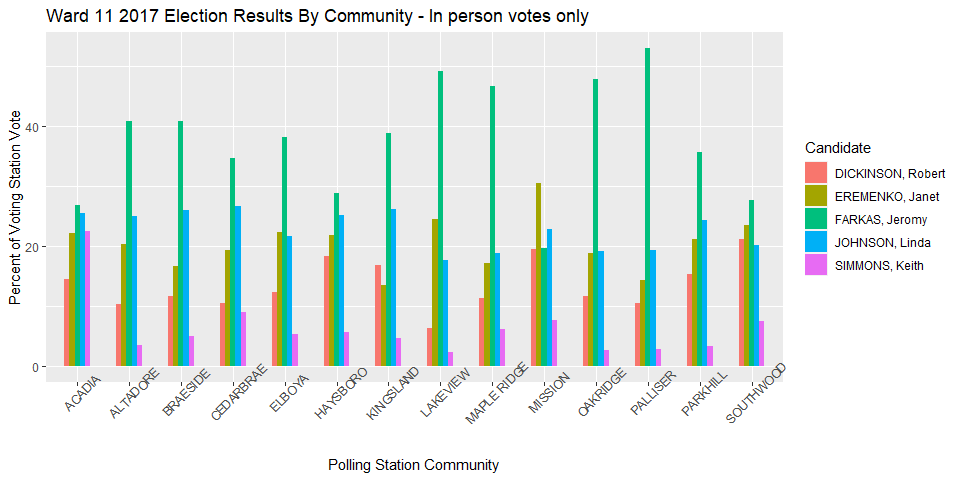

## Calgary Voting and Demographics  
This is a work in progress and very much still in it's early stages.  

This is an exploratory analysis looking at voting trends initially in Calgary's Ward 11. In the first stage I want to investigate if Ward 11 is homoegenous in it's voting patterns and visualize any differences between communities. 

Next steps include:
* comparisons across wards  
* comparisons between 2017 and previous elections  
* compare vote distribution for mayoral candidates and how correlatable they are with city councillor vote distributions. 

### Stage 2
I would like to investigate the relationship between voting patterns and demographics of a community and possibly comparison between municipal voting patterns and provincial and federal voting patterns.

Data was downloaded from the City of Calgary's Open Data website. 


### Assumptions and uncertainties
Taking community demographic data and comparing it to election results from that community will not be a perfect match since multiple communities will feed into a single polling station and certain demographics are likely over-represented in voters but it will make a good first approximation.I would also like to do some statistical analysis on any perceived trends and relationships to see if they are significant.

### Loading data
```r
library(tidyverse)
# load data
Elect <- read.csv("./2017_Official_Election_Results_by_Voting_Station.csv")
ComDemo <- read.csv("./Civic_Census_by_Community__Age_and_Gender.csv")
```


```r
ComDemo <- ComDemo %>% filter(YEAR != "1996")
```

### 2017 Calgary Civic Election Results.  
[link](https://data.calgary.ca/Government/2017-Official-Election-Results-by-Voting-Station/atsy-3a4w).  

#### Election Data Cleaning  
Election results include school board trustees we only care about city councillors and Mayor for now also remove unwanted columns.

```r
Elect <- Elect %>% 
  filter(Office %in% c("COUNCILLOR", "MAYOR")) %>%
  select(-Voting.Station.ID)
```

#### Voting Station Communities  
Election results are reported by voting station but do not have communities associated with the voting stations.  Demographic data is reported by community. To join these two datasets I need to get the communities that the voting stations are in. I did this by loading "voting station location" csv [link](https://data.calgary.ca/Government/Voting-Stations-Effective-October-16-2017-/ps5q-maip) and "community boundaries" shapefile [link](https://data.calgary.ca/Base-Maps/Community-Boundaries/surr-xmvs) (downloaded from the city of Calgary) into QGIS and creating an intersection layer which includes a community column in the voting stations table. I then exported that layer and imported it into R. 

```r
stationsWcomm <- read.csv("./VotingStationsWCommunity.csv")

# Get rid of unwanted columns
stationsWcomm <- stationsWcomm %>%
  select(VSTN_ID, NAME, comm_code, name_2)

# Join stationsWcomm df w the Elect df, match by name rather than stationID as some stations have multiple ID
ElectComm <- Elect %>% left_join(stationsWcomm, by = c("Voting.Station.Name" = "NAME"))

# investigate the voting stations that don't correspond to a community & how many votes are associated w them
NoCommunity <- subset(ElectComm, is.na(comm_code))
sum(NoCommunity$Votes) # votes not associated w a community
```

```
## [1] 22694
```

```r
sum(Elect$Votes) # total votes;
```

```
## [1] 752708
```
22694/752708  = 3.0%.  3% of votes will not be accounted for if I remove these rows.  

#### How are the unaccounted for votes classified
Determine what type of voting stations the votes with no associated community are from.

```r
table(NoCommunity$Voting.Station.Type)  
```

```
## 
##    Advance   Hospital    Mail-in    Regular    Special Travelling 
##        172        344         86         16       1025         86
```


## Votes not assigned to a voting station  
Try to make some prediction about the demographic of the unassigned votes and investigate to make sure there is nothing unusual about the votes before filtering them from the dataset


```r
NoCommunityType <- NoCommunity %>%
  group_by(Voting.Station.Type) %>%
  summarize(Votes2 = sum(Votes))
            
NoCommunityType <- mutate(NoCommunityType, percent = round(Votes2/sum(NoCommunityType$Votes2)*100, 0))
NoCommunityType
```

```
## # A tibble: 6 x 3
##   Voting.Station.Type Votes2 percent
## * <chr>                <int>   <dbl>
## 1 Advance               7030      31
## 2 Hospital              1087       5
## 3 Mail-in               4756      21
## 4 Regular               4157      18
## 5 Special               5193      23
## 6 Travelling             471       2
```
This table indicates that 23% of the NoCommunity votes are from a "special" Voting.Station.Type which appears to be the designation given for seniors residence. These votes could be reasonably assigned to +65 demographic.
**I need to do something with the below table to compare it to overall voting habits and make sure it all checks out. Maybe create visuals for each ward comparing unclassified votes to in-person votes to look for descrepencies**

```r
# Investigate there is nothing unusual about these votes
UnaccountedVotes <- NoCommunity %>%
  group_by(Office, Ward, Ballot.Name) %>%
  summarize(Votes2 = sum(Votes)) %>%
  arrange(desc(Votes2), .by_group = TRUE) %>%
  print()
```

```
## `summarise()` has grouped output by 'Office', 'Ward'. You can override using the `.groups` argument.
```

```
## # A tibble: 226 x 4
## # Groups:   Office, Ward [29]
##    Office      Ward Ballot.Name           Votes2
##    <chr>      <int> <chr>                  <int>
##  1 COUNCILLOR     1 SUTHERLAND, Ward         653
##  2 COUNCILLOR     1 BLISS TAYLOR, Coral      260
##  3 COUNCILLOR     1 BLATCH, Chris            117
##  4 COUNCILLOR     1 CHRISTENSEN, Cole         53
##  5 COUNCILLOR     1 KHAN, Cam                 35
##  6 COUNCILLOR     2 MAGLIOCCA, Joe           301
##  7 COUNCILLOR     2 WYNESS, Jennifer         242
##  8 COUNCILLOR     2 MAITLAND, Christopher     71
##  9 COUNCILLOR     2 GEORGEOU, George          19
## 10 COUNCILLOR     3 GONDEK, Jyoti            117
## # ... with 216 more rows
```

```r
## filter out the votes that are not assigned to a community
CommunityVotes <- subset(ElectComm, !is.na(comm_code))
```
## Ward 11
I started by looking at distribution of votes for Ward 11 City Councillor. Analysis indicates that 20% of Ward11 votes were cast in advance and are thus not associated with a voting station. I will only be looking at votes associated with a voting station so that I can compare them with community demographics in phase two. **I should come back and look at the vote distribution in advance voters to see if it matches in-person voting trends if possible.**

```r
# create a df of just Ward11 
Ward11 <- filter(CommunityVotes, Ward == "11", Office == "COUNCILLOR") 

# Determine percentage of votes cast in advance in Ward11
Ward11Advance <- Ward11 %>%
  group_by(Voting.Station.Type) %>%
  summarize(Votes2 = sum(Votes))
Ward11Advance <- mutate(Ward11Advance, percent = round(Votes2/sum(Votes2)*100,0))
Ward11Advance
```

```
## # A tibble: 2 x 3
##   Voting.Station.Type Votes2 percent
## * <chr>                <int>   <dbl>
## 1 Advance               6856      20
## 2 Regular              27132      80
```

```r
# Looking only at regular in-person voting
Ward11Regular <- Ward11 %>%
  filter(Voting.Station.Type == "Regular") %>%
  arrange(Voting.Station)
Ward11Percents <- Ward11Regular %>%
  group_by(Voting.Station) %>%
  mutate(percent = round(Votes/sum(Votes)*100, 1)) %>%
  relocate(Ward, Ballot.Name, Votes, percent, Voting.Station.Name, comm_code, name_2) ## rearranges columns
Ward11Councillors <- Ward11Percents %>%
  arrange(Ballot.Name)
Ward11Councillors
```

```
## # A tibble: 75 x 11
## # Groups:   Voting.Station [15]
##     Ward Ballot.Name Votes percent Voting.Station.~ comm_code name_2
##    <int> <chr>       <int>   <dbl> <chr>            <chr>     <chr> 
##  1    11 DICKINSON,~   404    19.5 St. Mary's Pari~ MIS       MISSI~
##  2    11 DICKINSON,~   183    15.4 Park Hill/ Stan~ PKH       PARKH~
##  3    11 DICKINSON,~   102    10.4 Altadore Elemen~ ALT       ALTAD~
##  4    11 DICKINSON,~   354    12.3 Elboya School    EYA       ELBOYA
##  5    11 DICKINSON,~   155     6.4 Jennie Elliott ~ LKV       LAKEV~
##  6    11 DICKINSON,~   366    18.4 Haysboro School  HAY       HAYSB~
##  7    11 DICKINSON,~   347    16.9 St. Augustine E~ KIN       KINGS~
##  8    11 DICKINSON,~   234    11.6 Louis Riel Scho~ OAK       OAKRI~
##  9    11 DICKINSON,~   176    10.5 Nellie McClung ~ PAL       PALLI~
## 10    11 DICKINSON,~   177    10.5 Cedarbrae School CED       CEDAR~
## # ... with 65 more rows, and 4 more variables: Voting.Station <int>,
## #   Voting.Station.Type <chr>, Office <chr>, VSTN_ID <int>
```

```r
# plot the percentage of vote for each candidate grouped by polling station
gWard11Col <- ggplot(Ward11Councillors, aes(fill = Ballot.Name, y = percent, x = name_2)) +
  geom_col(position = position_dodge(0.5), width = 0.5) +
  theme(axis.text.x = element_text(angle = 45)) +
  labs(x="Polling Station Community", y = "Percent of Voting Station Vote", fill = "Candidate") +
  ggtitle("Ward 11 2017 Election Results By Community - In person votes only")
gWard11Col
```

<!-- -->


Next steps: Take a look at those communities and overlay demographics maybe add Mayor bars.
compare to previous election, compare to provincial and federal elections, compare to special voters and advance voters, demographics from federal census?

### Civic Census by Community, Age, Gender from 1996 to 2019  
[link](https://data.calgary.ca/Demographics/Civic-Census-by-Community-Age-and-Gender/vsk6-ghca)

```r
GenderReport <- ComDemo %>%
  group_by(YEAR) %>%
  summarize(males = sum(MALES), females = sum(FEMALES)) %>%
  print()
```

```
## # A tibble: 10 x 3
##     YEAR  males females
##  * <int>  <int>   <int>
##  1  1996 767059       0
##  2  1999 422699  419689
##  3  2001 439514  437005
##  4  2004 467530  465965
##  5  2006 497449  494310
##  6  2009 537403  528052
##  7  2011 547782  543154
##  8  2014 594904  600290
##  9  2016 621021  614150
## 10  2019 641938  638369
```

The above table indicates that there was no gender reporting in the 1996 Civic Census Therefore filter out 1996.

To be continued...
